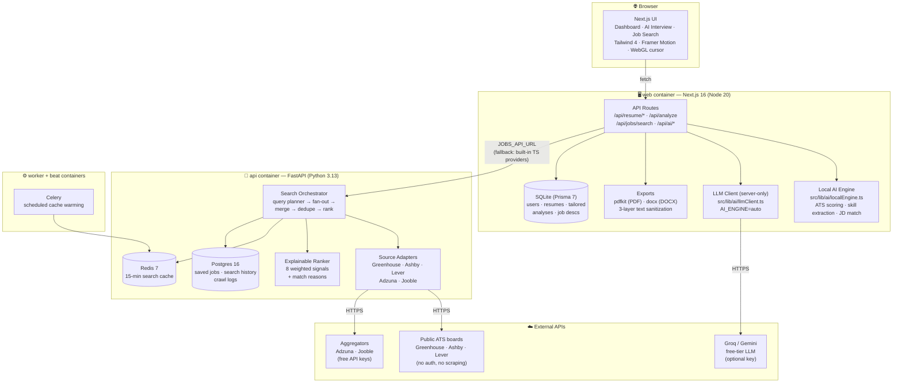
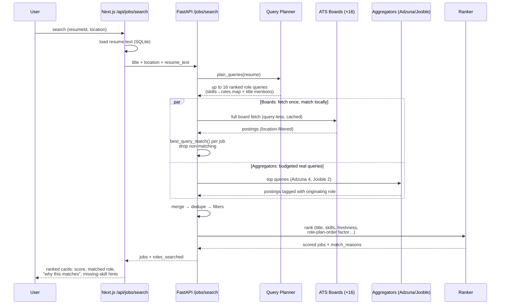
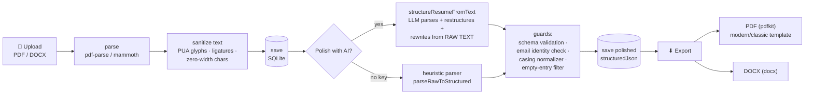
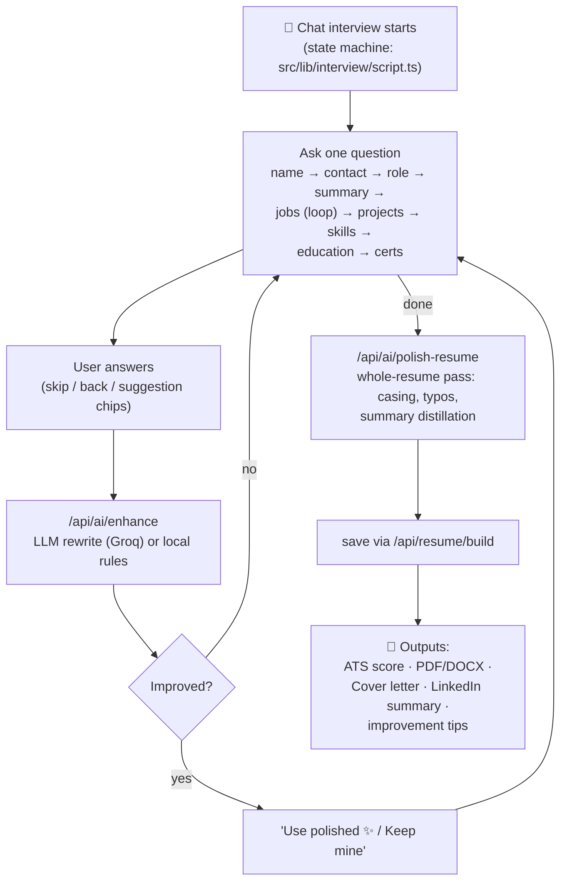
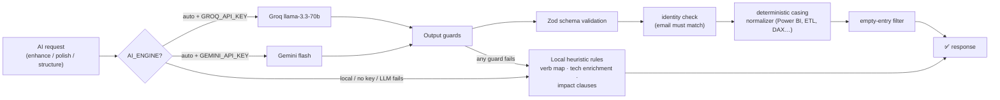
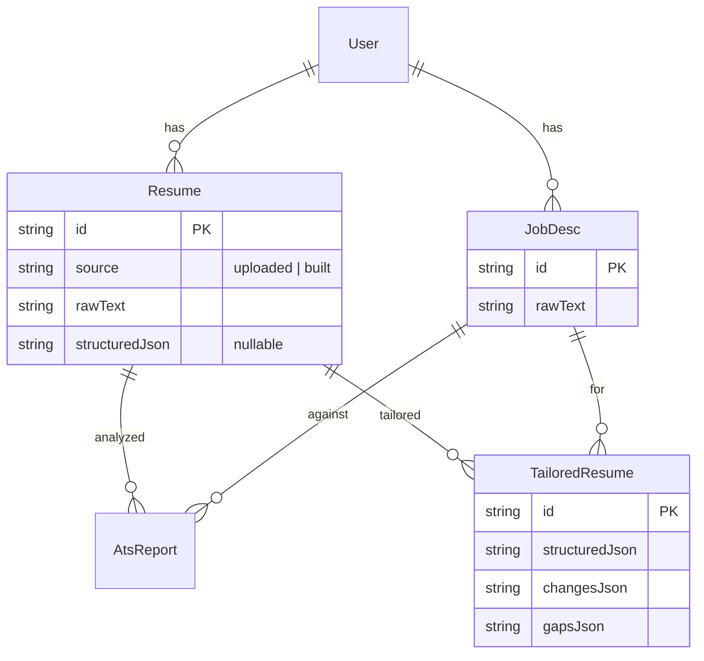

# Lumina — Architecture

> AI resume analyzer + intelligent job search. Free, open-source-ready, privacy-first by default.
> Landing page at `/`, working app at `/dashboard`.

---

## 1. System overview



**Six Docker containers** (`docker-compose.yml`): `web`, `api`, `postgres`, `redis`, `worker`, `beat`.
Public sharing via Cloudflare quick tunnels (`cloudflared tunnel --url http://localhost:3000`) — one-click `.bat` launchers in the repo root.

---

## 2. Tech stack

| Layer | Technology | Notes |
|---|---|---|
| Frontend | Next.js 16 (App Router, TS), Tailwind 4, Framer Motion, Lucide | Token-based theming: `data-mode` × `data-accent` on `<html>` |
| Frontend DB | Prisma 7 + SQLite (`webdata` volume) | Zero-infra default; swap `DATABASE_URL` for Postgres in prod |
| Job-search backend | FastAPI, SQLAlchemy async, Pydantic v2 | Separate service in `backend/` |
| Backend DB | Postgres 16 (asyncpg) | Saved jobs, search history, crawl logs |
| Cache | Redis 7, 15-min TTL | Graceful no-op degradation if down |
| Queue | Celery worker + beat | Scheduled cache warming |
| HTTP client | httpx + tenacity retries | UA rotation, pooling, timeouts |
| AI tier 1 | Local heuristic engine (pure TS) | Always available, fully offline |
| AI tier 2 | Groq `llama-3.3-70b` / Gemini flash | `AI_ENGINE=auto`, server-only keys |
| PDF export | pdfkit (WinAnsi-safe) | Modern/classic templates, accent colors |
| DOCX export | docx | Mirrors PDF layout |
| Effects | Custom WebGL Navier-Stokes fluid cursor | `SplashCursor.tsx`, theme-accent colored |

---

## 3. Flow: intelligent job search

The core innovation — **resume → multi-query fan-out**, not single-keyword search.



Resilience: per-source **circuit breakers**, Redis caching per (source, query, location), and if the FastAPI backend is down entirely, the Next.js route **falls back to built-in TypeScript providers** so search never hard-fails.

---

## 4. Flow: resume upload → AI polish → export



**Sanitization is 3-layer** (mojibake was a recurring bug class): at upload, at download (`sanitizeDeep`), and at PDF render (`toWinAnsi` drops anything WinAnsi can't encode).

---

## 5. Flow: AI Resume Interview



Guard: if the user pastes their **entire old resume** into the summary question (>500 chars or contains date ranges), it's absorbed as context instead of stored as the summary — the polish pass writes a real 2-3 sentence summary at the end.

---

## 6. AI engine — tiered, pluggable, guarded



Principles enforced in every prompt:
- **Never invent** employers, dates, tools, or numeric metrics.
- **Preserve every real detail** (numbers, named systems, architectures) — compressing them away is a failure.
- **Banned filler**: "results-driven", "proven ability", "leverage", "utilize", "team player", …
- Casing is **never trusted to the model** — normalized deterministically after.

Privacy: with no LLM key, everything is fully offline. With a key, resume text is sent to Groq/Google **only** for the AI-writing features (explicit opt-in by configuring the key).

---

## 7. Data model (frontend SQLite, Prisma)



Backend Postgres holds: `saved_jobs`, `search_history`, `crawler_logs` (keyed by client id).

---

## 8. Key directories

```
resume/
├─ src/
│  ├─ app/api/            # Next.js API routes (resume, analyze, jobs, ai/*)
│  ├─ components/dashboard/  # Dashboard, InterviewSection, JobSearchSection,
│  │                          # ResumeStudio, BuilderSection, PolishResumeCard
│  ├─ components/cursor/   # SplashCursor (WebGL fluid) + CursorFX
│  ├─ lib/ai/              # localEngine, llmClient, polishResume, skillCasing
│  ├─ lib/interview/       # script (state machine), enhance, careerDocs
│  ├─ lib/jobs/            # TS fallback providers
│  └─ lib/                 # generatePdf, generateDocx, textSanitize, resumeDownload
├─ backend/app/
│  ├─ api/                 # routes + rate limiting deps
│  ├─ crawler/adapters/    # greenhouse, ashby, lever, adzuna, jooble
│  ├─ services/            # search_service, query_planner, filters
│  ├─ ranking/             # ranker, dedupe
│  ├─ cache/  scheduler/  utils/  database/
├─ docker-compose.yml      # 6 services
├─ Dockerfile.web  backend/Dockerfile
└─ PROJECT_STATUS.md       # living handoff doc (read first!)
```

---

## 9. Resilience & security patterns

| Pattern | Where |
|---|---|
| Graceful degradation | Backend down → TS providers; Redis down → no-op cache; no LLM key → local rules; invalid LLM output → original returned |
| Circuit breakers | Per job-source, N failures → cooldown skip |
| Rate limiting | Sliding window per client (in-memory — move to Redis before multi-replica) |
| Aggregator budgets | Adzuna 4 queries/search, Jooble 2 (500-request free tier) |
| Secrets | Git-ignored `.env`, server-only LLM client, compose `${VAR:-}` interpolation |
| Input sanitization | 3-layer text cleanup (upload/download/render) |
| LLM output guards | Zod schema + identity check + casing normalizer + empty-entry filter |

### Known gaps (deliberate, documented for scale-up)
- Rate limiter is in-memory (single instance only) — needs Redis token bucket for replicas
- Upload validates file extension only — magic-byte (MIME) verification recommended
- No `restart:` policies in compose; no cache-stampede protection (TTL jitter/locks)
- SQLite for user data — migrate to managed Postgres before multi-user
```
